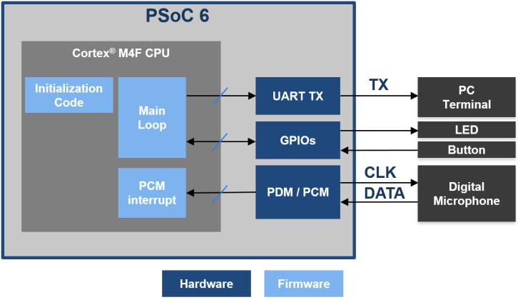

# CE219431 - PSoC 6 MCU PDM-to-PCM Example

This example demonstrates how to use the pulse-density modulation/pulse-code modulation (PDM/PCM) hardware block in PSoC 6 MCU with a digital microphone.

## Overview

This code example shows how to use a digital microphone with the PDM/PCM block. It measures the sound intensity (volume), and turns ON an LED when the volume exceeds a threshold. You can reset the threshold by pressing a switch; you can use this to capture the environment noise and set a new threshold above the noise. A debug UART reports the current volume.

[Figure 1](#figure-1-block-diagram) shows the high-level block diagram of the interface between PSoC 6 and the microphone and user interface elements.

Figure 1. Block Diagram



## Requirements

- [ModusToolbox IDE](https://www.cypress.com/ModusToolbox) v2.0  
- Programming Language: C  
- Associated Parts: All [PSoC 6 MCU](https://www.cypress.com/PSoC6) parts

## Supported Kits
- [PSoC 6 Wi-Fi BT Prototyping Kit](https://www.cypress.com/CY8CPROTO-062-4343W) (CY8CPROTO-062-4343W) - Default target
- [PSoC 6 WiFi-BT Pioneer Kit](https://www.cypress.com/CY8CKIT-062-WiFi-BT) (CY8CKIT-062-WiFi-BT)
- [PSoC 6 BLE Pioneer Kit](https://www.cypress.com/CY8CKIT-062-BLE) (CY8CKIT-062-BLE)

## Hardware Setup

This example uses the kit’s default configuration. Refer to the kit guide to ensure the kit is configured correctly.

**Note**: The PSoC 6 BLE Pioneer kit and the PSoC 6 WiFi-BT Pioneer kit ship with KitProg2 installed. ModusToolbox software requires KitProg3. Before using this code example, make sure that the kit is upgraded to KitProg3. The tool and instructions are available in the [Firmware Loader](https://github.com/cypresssemiconductorco/Firmware-loader) GitHub repository. If you do not upgrade, you will see an error like “unable to find CMSIS-DAP device” or “KitProg firmware is out of date”.

## Software Setup

Install a terminal emulator if you don't have one. Instructions in this document use [Tera Term](https://ttssh2.osdn.jp/index.html.en).

## Using the Code Example

### In ModusToolbox IDE:

1. Click the **New Application** link in the Quick Panel (or, use **File > New > ModusToolbox IDE Application**).
2. Pick your kit. You must use a kit or device supported by the code example.  Some application settings (e.g., which pin controls an LED) may be adjusted automatically based on the kit you select.
3. In the **Starter Application** window, choose the example.
4. Click **Next** and complete the application creation process.

 See [Importing Code Example into ModusToolbox IDE - KBA225201](https://community.cypress.com/docs/DOC-15968) for details.


### In Command-line Interface (CLI):

1. Download and unzip this repository onto your local machine, or clone the repository.
2. Open a CLI terminal and navigate to the application folder.
3. Import required libraries by executing the `make getlibs` command.

## Operation

1. Connect the board to your PC using the provided USB cable through the USB connector.

2. Open a terminal program and select the KitProg3 COM port. Set the serial port parameters to 8N1 and 115,200 baud.

3. Program the board. 

   ### Using ModusToolbox IDE:

   1. Select the application project in the Project Explorer.
   2. In the **Quick Panel**, scroll down, and click **\<Application Name> Program (KitProg3)**. 

   ### Using CLI:

   1. From the terminal, execute the `make program`  command to build and program the application using the default toolchain to the default target. You can specify a target and toolchain manually:
        ```
        make program TARGET=<BSP> TOOLCHAIN=<toolchain>
        ```
        Example:

        ```
        make program TARGET=CY8CPROTO-062-4343W TOOLCHAIN=GCC_ARM
        ```
        **Note**:  Before building the application, ensure the *libs* folder contains the BSP (*.lib*) file corresponding to the TARGET. Execute the `make getlibs` command to fetch the BSP contents before building the application.

4. After programming, the application starts automatically. Confirm that the serial terminal reports the volume in real time.

5. Touch, speak, or play any sound over the microphone. Observe that the kit's LED turns ON.

6. If the LED is always ON or blinking, without playing any sound over the microphone, press the kit's button to reset the noise threshold. 

## Debugging

You can debug the example to step through the code. In the ModusToolbox IDE, use the **\<Application Name> Debug (KitProg3)** configuration in the **Quick Panel**. See [Debugging a PSoC 6 MCU ModusToolbox Project - KBA224621](https://community.cypress.com/docs/DOC-15763) for details.

## Design and Implementation

All the kits supported by this code example come with a digital microphone with a single-bit PDM output. This allows you to convert any audio captured by the microphone into a digital signal (PDM). The PSoC 6 MCU device converts this digital signal to a quantized 16-bit value (PCM). An interrupt is triggered when there is enough data to be processed (at least 128 samples). The absolute values of the samples are summed. This represents the overall loudness of the sound, which is proportional to the volume.

The PDM/PCM block is configured for a sampling rate of 8 ksps. Because this application only calculates the volume, a higher sample rate for better audio quality is not required. Ideally, the audio wave captured should oscillate around zero. The PDM/PCM hardware integrates a high-pass filter. This filter attenuates low frequencies that add offset to the conversion.

The calculated volume is sent over the UART. Use a terminal program on your PC to observe the data. The code example also turns ON a kit LED when the calculated volume is greater than a predefined threshold. The threshold can be used as a noise threshold so that this example can run in noisy environments. By pressing the kit's button, you can set a new noise threshold based on the current volume. Note that you should remove any source of sound and avoid speaking close to the microphone while pressing the button.

### Resources and Settings

[Table 1](#table-1-application-resources) lists the ModusToolbox resources used in this example, and how they are used in the design.

##### Table 1. Application Resources
| Resource  |  Alias/Object     |    Purpose     |
| :------- | :------------    | :------------ |
| PCM/PDM (PDL) | CYBSP_PDM_PCM  | To interface with digital microphones |
| UART (HAL) | cy_retarget_io_uart_obj | UART HAL object used by Retarget-IO for printing to the console |
| LED (HAL) | CYBSP_USER_LED | User LED to turn when some sound is detected |
| Button (HAL) | CYBSP_USER_BTN | User Button to reset noise threshold |

## Related Resources

| Application Notes                                            |                                                              |
| :----------------------------------------------------------- | :----------------------------------------------------------- |
| [AN228571](https://www.cypress.com/AN228571) – Getting Started with PSoC 6 MCU on ModusToolbox | Describes PSoC 6 MCU devices and how to build your first application with ModusToolbox |
| [AN221774](https://www.cypress.com/AN221774) – Getting Started with PSoC 6 MCU on PSoC Creator | Describes PSoC 6 MCU devices and how to build your first application with PSoC Creator |
| [AN210781](https://www.cypress.com/AN210781) – Getting Started with PSoC 6 MCU with Bluetooth Low Energy (BLE) Connectivity on PSoC Creator | Describes PSoC 6 MCU with BLE Connectivity devices and how to build your first application with PSoC Creator |
| [AN215656](https://www.cypress.com/AN215656) – PSoC 6 MCU: Dual-CPU System Design | Describes the dual-CPU architecture in PSoC 6 MCU, and shows how to build a simple dual-CPU design |
| **Code Examples**                                            |                                                              |
| [Using ModusToolbox IDE](https://github.com/cypresssemiconductorco/Code-Examples-for-ModusToolbox-Software) | [Using PSoC Creator](https://www.cypress.com/documentation/code-examples/psoc-6-mcu-code-examples) |
| **Device Documentation**                                     |                                                              |
| [PSoC 6 MCU Datasheets](https://www.cypress.com/search/all?f[0]=meta_type%3Atechnical_documents&f[1]=resource_meta_type%3A575&f[2]=field_related_products%3A114026) | [PSoC 6 Technical Reference Manuals](https://www.cypress.com/search/all/PSoC%206%20Technical%20Reference%20Manual?f[0]=meta_type%3Atechnical_documents&f[1]=resource_meta_type%3A583) |
| **Development Kits**                                         | Buy at Cypress.com                                     |
| [CY8CKIT-062-BLE PSoC 6 BLE Pioneer Kit](http://www.cypress.com/CY8CKIT-062-BLE) | [CY8CKIT-062-WiFi-BT PSoC 6   WiFi-BT Pioneer Kit](http://www.cypress.com/CY8CKIT-062-WiFi-BT) |
| [CY8CPROTO-063 BLE PSoC 6 BLE Prototyping   Kit](http://www.cypress.com/CY8CPROTO-063-BLE) | [CY8CPROTO-062-4343W   PSoC 6 Wi-Fi BT Prototyping Kit](http://www.cypress.com/cy8cproto-062-4343w) |
| **Libraries**                                                |                                                              |
| PSoC 6 Peripheral Driver Library and docs                    | [psoc6pdl](https://github.com/cypresssemiconductorco/psoc6pdl) on GitHub |
| Cypress Hardware Abstraction Layer Library and docs          | [psoc6hal](https://github.com/cypresssemiconductorco/psoc6hal) on GitHub |
| RetargetIO - A utility library to retarget the standard input/output (STDIO) messages to a UART port | [retarget-io](https://github.com/cypresssemiconductorco/retarget-io) on GitHub |
| **Middleware**                                               |                                                              |
| CapSense library and docs                                    | [capsense](https://github.com/cypresssemiconductorco/capsense) on GitHub |
| Links to all PSoC 6 MCU Middleware                           | [psoc6-middleware](https://github.com/cypresssemiconductorco/psoc6-middleware) on GitHub |
| **Tools**                                                   |                                                              |
| [ModusToolbox   IDE](http://www.cypress.com/modustoolbox)    | The Cypress IDE for PSoC 6 and IoT designers                 |
| [PSoC Creator](https://www.cypress.com/products/psoc-creator-integrated-design-environment-ide) | The Cypress IDE for PSoC and FM0+ development                |

## Other Resources

Cypress provides a wealth of data at www.cypress.com to help you to select the right device, and quickly and effectively integrate the device into your design.

For PSoC 6 MCU devices, see [How to Design with PSoC 6 MCU - KBA223067](https://community.cypress.com/docs/DOC-14644) in the Cypress community.

## Document History

Document Title: *CE219431 - PSoC 6 MCU PDM-to-PCM Example*

| Version | Description of Change |
| ------- | --------------------- |
| 1.0.0   | New code example      |

------

All other trademarks or registered trademarks referenced herein are the property of their respective
owners.


-------------------------------------------------------------------------------

© Cypress Semiconductor Corporation, 2019. This document is the property of Cypress Semiconductor Corporation and its subsidiaries ("Cypress"). This document, including any software or firmware included or referenced in this document ("Software"), is owned by Cypress under the intellectual property laws and treaties of the United States and other countries worldwide. Cypress reserves all rights under such laws and treaties and does not, except as specifically stated in this paragraph, grant any license under its patents, copyrights, trademarks, or other intellectual property rights. If the Software is not accompanied by a license agreement and you do not otherwise have a written agreement with Cypress governing the use of the Software, then Cypress hereby grants you a personal, non-exclusive, nontransferable license (without the right to sublicense) (1) under its copyright rights in the Software (a) for Software provided in source code form, to modify and reproduce the Software solely for use with Cypress hardware products, only internally within your organization, and (b) to distribute the Software in binary code form externally to end users (either directly or indirectly through resellers and distributors), solely for use on Cypress hardware product units, and (2) under those claims of Cypress's patents that are infringed by the Software (as provided by Cypress, unmodified) to make, use, distribute, and import the Software solely for use with Cypress hardware products. Any other use, reproduction, modification, translation, or compilation of the Software is prohibited.  
TO THE EXTENT PERMITTED BY APPLICABLE LAW, CYPRESS MAKES NO WARRANTY OF ANY KIND, EXPRESS OR IMPLIED, WITH REGARD TO THIS DOCUMENT OR ANY SOFTWARE OR ACCOMPANYING HARDWARE, INCLUDING, BUT NOT LIMITED TO, THE IMPLIED WARRANTIES OF MERCHANTABILITY AND FITNESS FOR A PARTICULAR PURPOSE. No computing device can be absolutely secure. Therefore, despite security measures implemented in Cypress hardware or software products, Cypress shall have no liability arising out of any security breach, such as unauthorized access to or use of a Cypress product. CYPRESS DOES NOT REPRESENT, WARRANT, OR GUARANTEE THAT CYPRESS PRODUCTS, OR SYSTEMS CREATED USING CYPRESS PRODUCTS, WILL BE FREE FROM CORRUPTION, ATTACK, VIRUSES, INTERFERENCE, HACKING, DATA LOSS OR THEFT, OR OTHER SECURITY INTRUSION (collectively, "Security Breach"). Cypress disclaims any liability relating to any Security Breach, and you shall and hereby do release Cypress from any claim, damage, or other liability arising from any Security Breach. In addition, the products described in these materials may contain design defects or errors known as errata which may cause the product to deviate from published specifications. To the extent permitted by applicable law, Cypress reserves the right to make changes to this document without further notice. Cypress does not assume any liability arising out of the application or use of any product or circuit described in this document. Any information provided in this document, including any sample design information or programming code, is provided only for reference purposes. It is the responsibility of the user of this document to properly design, program, and test the functionality and safety of any application made of this information and any resulting product. "High-Risk Device" means any device or system whose failure could cause personal injury, death, or property damage. Examples of High-Risk Devices are weapons, nuclear installations, surgical implants, and other medical devices. "Critical Component" means any component of a High-Risk Device whose failure to perform can be reasonably expected to cause, directly or indirectly, the failure of the High-Risk Device, or to affect its safety or effectiveness. Cypress is not liable, in whole or in part, and you shall and hereby do release Cypress from any claim, damage, or other liability arising from any use of a Cypress product as a Critical Component in a High-Risk Device. You shall indemnify and hold Cypress, its directors, officers, employees, agents, affiliates, distributors, and assigns harmless from and against all claims, costs, damages, and expenses, arising out of any claim, including claims for product liability, personal injury or death, or property damage arising from any use of a Cypress product as a Critical Component in a High-Risk Device. Cypress products are not intended or authorized for use as a Critical Component in any High-Risk Device except to the limited extent that (i) Cypress's published data sheet for the product explicitly states Cypress has qualified the product for use in a specific High-Risk Device, or (ii) Cypress has given you advance written authorization to use the product as a Critical Component in the specific High-Risk Device and you have signed a separate indemnification agreement.  
Cypress, the Cypress logo, Spansion, the Spansion logo, and combinations thereof, WICED, PSoC, CapSense, EZ-USB, F-RAM, and Traveo are trademarks or registered trademarks of Cypress in the United States and other countries. For a more complete list of Cypress trademarks, visit cypress.com. Other names and brands may be claimed as property of their respective owners.
